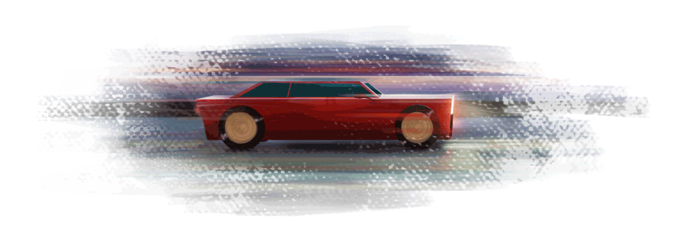

   

# Racer

This certificate is from the mini course from [Alura](https://www.alura.com.br/) called ["Imersão GameDev"](https://www.alura.com.br/imersao-gamedev-javascript/) and consists on create a game (that I Named "Racer") with [P5.js](https://p5js.org/). We mainly use [P5.js](https://p5js.org/) to do that. I won the third place!

 

    

---

# Guide

* [Features](#features)
* [Making of](#making-of)
* [Installation](#installation)
* [Technologies](#technologies)
* [Future Implementations](#future-implementations)

# Features

*  Users can driver an speedy car from and road.
*  Car has a horn (can be used by pressing "h").
*  Fake Z-depth effect using [P5.js](https://p5js.org/)
*  The sound of the engine changes depending on the distance from the camera
*  Can hit other cars
*  Other cars has "passing" sound
*  We have 5 lives
*  We have and odometer on the screen
*  The game configuration can be done through a JSON file inside "CARTRIDGE" folder.

# Making of

The game was created in 2 days. So, at first, I wrote the main goals on [Trello](https://trello.com/). 
So, after that, I did the sketch of the main car:

    

The is the main visual from the sketch:

    

And the final colours from that:

    

We can see a little from the sprite sheet of the car:

    

The musics were record on the last day:

    

# Installation

 Just go [HERE](https://editor.p5js.org/cledman/sketches/IZVZsrWUY) and press the "play" button 
 

# Technologies

* [P5.js](https://p5js.org/) to handle the game, 
* [Photoshop](https://www.adobe.com/br/products/photoshop.html) for the sprites and animations
* [Sonar](http://www.cakewalk.com/products/SONAR) to handle the music
* [Audacity](https://audacity.br.uptodown.com/windows) to record sound effects

# Future Implementations

* We could create more cars and make them appear dynamically
* We could have check points and a "Goal" to arrive.
* Each level could be on different location and with different weather.

Thanks to [Alura](https://www.alura.com.br/).
##

